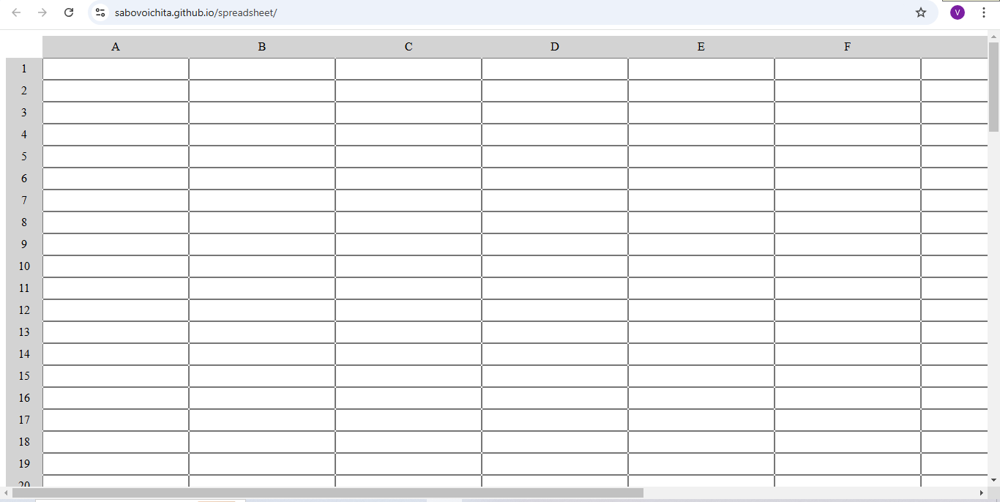

# Spreadsheet

In this spreadsheet application project, you'll learn about parsing and evaluating mathematical expressions, implementing spreadsheet functions, handling cell references, and creating interactive web interfaces. You'll learn how to dynamically update the page based on user input.

# [live](https://sabovoichita.github.io/spreadsheet/)

